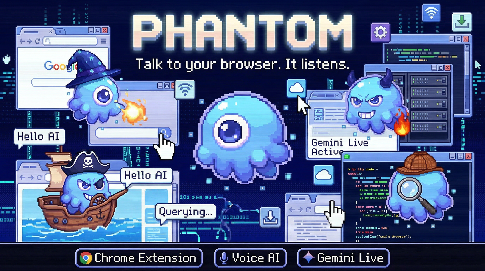
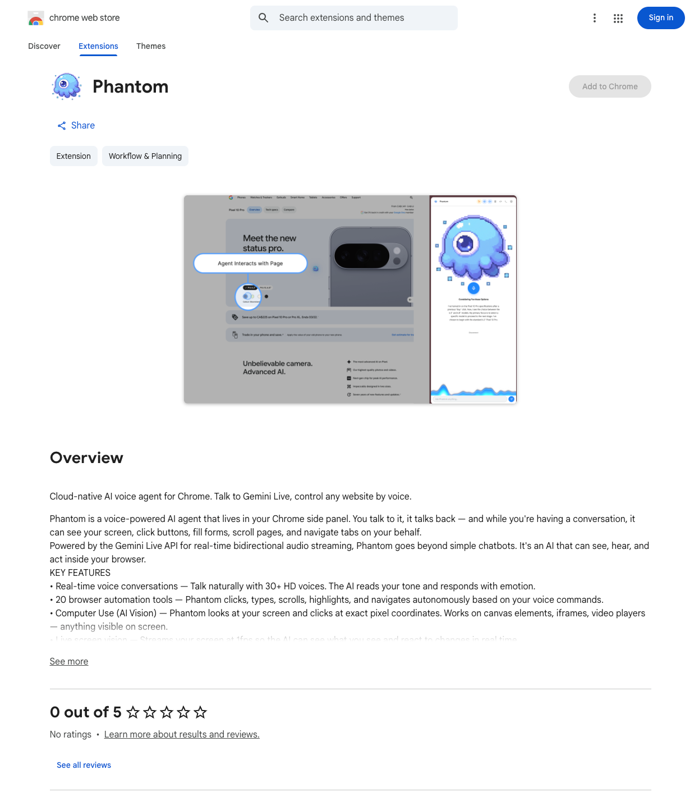
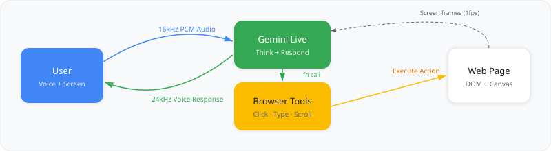
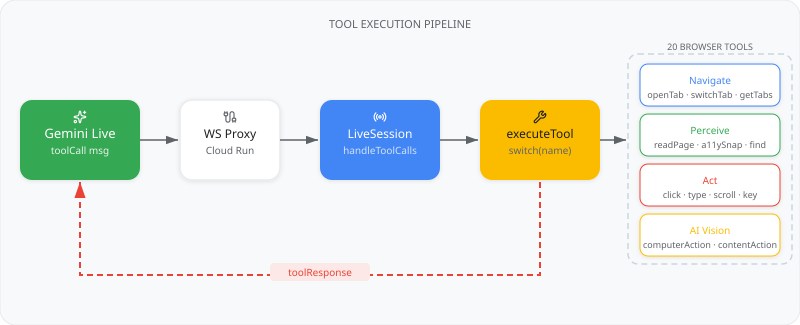
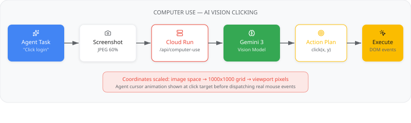
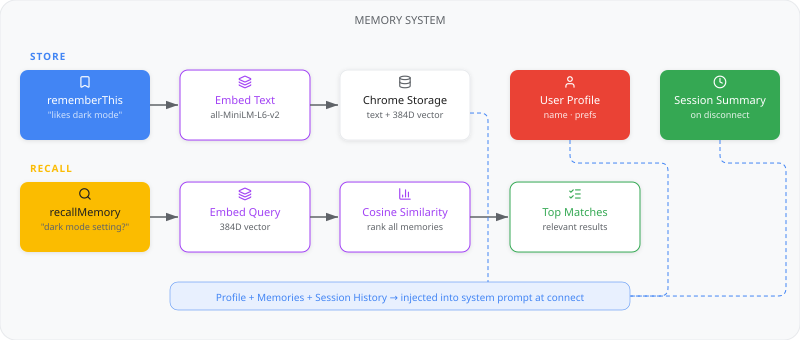
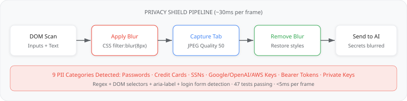
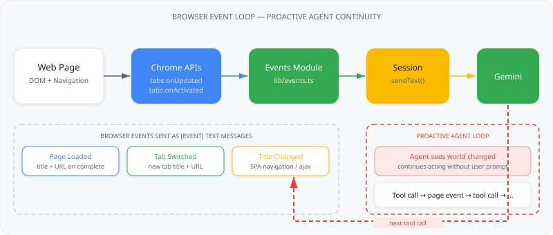
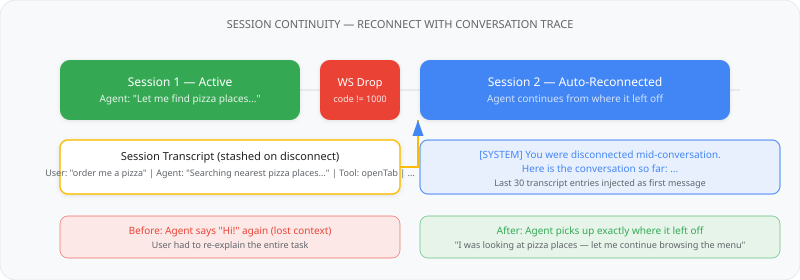

<div align="center">




# Phantom

**Talk to your browser. It listens.**

Voice-powered AI agent for Chrome — clicks, scrolls, reads, and navigates for you.


[Website](https://phantom-server-pio3n3nsna-uc.a.run.app) · [Blog](https://phantom-server-pio3n3nsna-uc.a.run.app/blog) · [Download](https://github.com/youneslaaroussi/Phantom/releases/latest)

</div>

<div align="center">


</div>

---

## Hackathon Submission — Quick Links for Judges

| Requirement | Evidence |
|---|---|
| **Gemini Model** | Gemini 2.5 Flash Native Audio via Live API — [`server/src/proxy.ts`](server/src/proxy.ts) |
| **Google GenAI SDK** | `@google/genai` for Live sessions, computer use, summarization — [`server/src/proxy.ts`](server/src/proxy.ts), [`server/src/computer-use.ts`](server/src/computer-use.ts), [`server/src/summarize.ts`](server/src/summarize.ts) |
| **Google Cloud Service** | Cloud Run (WebSocket proxy + AI endpoints) — [`deploy.sh`](deploy.sh), [`server/Dockerfile`](server/Dockerfile) |
| **Architecture Diagram** | [System Architecture](docs/system-architecture.svg) + [8 more subsystem diagrams](docs/) |
| **Automated Deployment** | Single-command deploy: Docker build → Artifact Registry → Cloud Run → GitHub Release — [`deploy.sh`](deploy.sh) |
| **Blog** | [Full building story](blog/phantom-building-story.md) covering architecture, privacy, character design, and AI-assisted development. Created for the #GeminiLiveAgentChallenge. |
| **Categories** | **Live Agent** (real-time voice + interruption) · **UI Navigator** (computer use + 20 browser tools) |

---

## Table of Contents

- [Overview](#overview)
- [Quick Start](#quick-start)
- [Design Notes](#design-notes)
  - [Architecture](#architecture)
  - [Voice Interaction Loop](#voice-interaction-loop)
  - [Tool Execution Pipeline](#tool-execution-pipeline)
  - [Computer Use — AI Vision Clicking](#computer-use--ai-vision-clicking)
  - [Memory System](#memory-system)
  - [Privacy Shield](#privacy-shield)
  - [Personas](#personas)
  - [Tab Audio Streaming](#tab-audio-streaming)
  - [Session Resumption](#session-resumption)
  - [Browser Events — Proactive Agent Loop](#browser-events--proactive-agent-loop)
  - [Session Continuity — Reconnect with Trace](#session-continuity--reconnect-with-trace)
- [Features](#features)
- [Google Technology Stack](#google-technology-stack)
- [Codebase Structure](#codebase-structure)
- [Development](#development)
- [Contributing](#contributing)
- [License](#license)

---

## Overview

Phantom is a voice-controlled AI agent that lives in your Chrome side panel. You talk to it, it talks back — and while you're having a conversation, it can see your screen, click buttons, fill forms, scroll pages, and navigate tabs on your behalf. It's powered by the Gemini Live API for real-time bidirectional audio streaming over WebSocket, with a Cloud Run proxy relaying messages between the extension and Google's servers.

**Key capabilities:**
- Real-time voice conversations with 30+ HD voices and affective dialog (reads your tone)
- 20 browser automation tools — the agent clicks, types, scrolls, highlights, and navigates autonomously
- Computer Use via Gemini 3 Flash vision model — AI looks at a screenshot and clicks at exact pixel coordinates
- Live screen vision at 1fps — Phantom sees what you see and reacts to changes
- Tab audio streaming — Phantom hears what you hear (videos, podcasts, music playing in the browser)
- Persistent memory with local vector embeddings (all-MiniLM-L6-v2) — remembers you across sessions
- Privacy shield that auto-blurs passwords, credit cards, and SSNs before any screenshot reaches the AI
- 9 pixel-art personas, each with a unique voice, personality, and sprite animations

---

## Quick Start

### 1. Install the extension

**Fastest:** Install directly from the [Chrome Web Store](https://chromewebstore.google.com/detail/phantom/pfhlohjaccmfjocncjieckpphcamfeom).

<div align="center">
<a href="https://chromewebstore.google.com/detail/phantom/pfhlohjaccmfjocncjieckpphcamfeom">

</a>
</div>

**Or manually:** Download from [Releases](https://github.com/youneslaaroussi/Phantom/releases/latest), unzip, load unpacked in `chrome://extensions`.

### 2. Get a Gemini API key

Free from [Google AI Studio](https://aistudio.google.com/apikey).

### 3. Talk

Open the side panel, pick a persona, tap the mic.

<div align="center">

</div>

---

## Design Notes

Phantom's architecture is split across two layers: a Chrome extension that handles voice capture, UI, tool execution, and browser automation; and a lightweight Cloud Run server that proxies WebSocket connections to Gemini and hosts sidecar AI endpoints for computer use and content actions.

### Architecture

<div align="center">

</div>

The extension maintains a single persistent WebSocket connection through the proxy to the Gemini Live API. All communication — audio, text, tool calls, tool responses, vision frames, tab audio — flows through this one socket. The proxy is stateless; it relays messages verbatim and manages the GenAI SDK session object.

### Voice Interaction Loop

<div align="center">

</div>

The voice loop is the core interaction cycle:

1. **User speaks** — `AudioCapture` records PCM 16kHz mono from the microphone
2. **Audio streams** — Raw PCM chunks are sent over WebSocket to the proxy, which relays them to Gemini
3. **Gemini processes** — The model hears the user, thinks, and responds with audio + optional tool calls
4. **Audio plays back** — Response audio streams back through the proxy and plays via `AudioPlayer`
5. **Tools execute** — If Gemini requests tool calls, the extension executes them locally and sends results back
6. **Gemini continues** — After receiving tool results, the model can speak again or call more tools

The model handles turn-taking natively through voice activity detection. When the user starts speaking while the model is talking, the server sends an interruption signal and the audio queue clears.

### Tool Execution Pipeline

<div align="center">

</div>

Phantom exposes 20 browser tools to Gemini as function declarations. When the model decides to use a tool, it sends a `toolCall` message through the WebSocket. The extension's `LiveSession` client receives it, dispatches to `executeTool()`, and sends the result back as a `toolResponse`. Gemini then continues its turn — it may speak, call more tools, or finish.

Tools are organized into categories:

| Category | Tools | What They Do |
|----------|-------|--------------|
| **Navigate** | `openTab`, `switchTab`, `getTabs` | Tab management and navigation |
| **Perceive** | `readPageContent`, `getAccessibilitySnapshot`, `findOnPage`, `getPageTitle` | Understand what's on the page |
| **Act** | `clickOn`, `typeInto`, `pressKey`, `scrollDown`, `scrollUp`, `scrollTo`, `highlight` | Interact with page elements via CSS selectors |
| **AI Vision** | `computerAction`, `contentAction` | Vision-based clicking and on-page AI popups |
| **Memory** | `rememberThis`, `recallMemory`, `updateUserProfile` | Persistent memory across sessions |

The agent is instructed to prefer `computerAction` (AI vision clicking) as its primary interaction tool, falling back to CSS selector-based tools for simple repetitive tasks where speed matters.

### Computer Use — AI Vision Clicking

<div align="center">

</div>

<div align="center">

</div>

Computer Use is a sidecar AI pipeline for coordinate-level clicking. When the voice model calls `computerAction("click the blue login button")`, the extension:

1. **Captures a screenshot** of the active tab (JPEG, 60% quality, compressed)
2. **Sends it to the Cloud Run server** along with the task description
3. **Gemini 3 Flash** (vision model) analyzes the screenshot and returns an action plan: click at (x, y), type "hello", scroll down, etc.
4. **Coordinates are rescaled** from the compressed image dimensions to a 1000x1000 grid, then to actual viewport pixels
5. **Actions execute** on the page by dispatching real mouse/keyboard events via `chrome.scripting.executeScript`
6. **An animated cursor** appears at the click target before the actual click, so the user can see what the agent is doing

This works on everything — canvas elements, iframes, video players, complex UIs — because it operates on pixels, not DOM selectors.

### Memory System

<div align="center">

</div>

Phantom remembers you across sessions through three layers:

**User Profile** — Durable facts stored via `updateUserProfile`: your name, preferences, and anything the agent learns about you. Injected into every system prompt.

**Semantic Memories** — Facts stored via `rememberThis`. Each memory is embedded into a 384-dimensional vector using all-MiniLM-L6-v2 (running locally via Transformers.js WASM). When the agent calls `recallMemory`, the query is embedded and compared against all stored memories using cosine similarity, returning the most relevant matches.

**Session Summaries** — When you disconnect, the full conversation transcript is summarized by Gemini 2.5 Flash and stored. On next connect, recent session summaries are injected into the system prompt so the agent has continuity.

All memory lives in Chrome's local storage. Nothing leaves your device.

### Privacy Shield

Sensitive content is automatically blurred before any screenshot reaches the AI.

<div align="center">

</div>

Before every vision frame capture, the privacy shield:

1. **Scans the DOM** for sensitive elements — password fields, credit card inputs, elements containing SSN/API key patterns
2. **Applies CSS blur** (`filter: blur(8px)`) to matched elements
3. **Captures the screenshot** — sensitive content is already blurred in the image
4. **Removes the blur** — restores original styles so the user sees no change

The entire pipeline runs in ~30ms per frame. Detection uses both CSS selectors (input types, autocomplete attributes) and regex patterns for text content (credit card numbers, SSNs, API keys, bearer tokens).

### Personas

Phantom ships with 9 personas, each with a unique Gemini voice, system prompt personality, and pixel-art sprite animations (idle, listening, talking, thinking states):

<div align="center">

</div>

Personas are defined in `extension/lib/personas.ts`. Switching personas disconnects and reconnects with a new system prompt and voice. The animated mascot in the UI reflects the current state — sleeping when disconnected, listening when the mic is on, talking when the agent speaks, and thinking when a tool is executing.

### Tab Audio Streaming

Phantom can hear what's playing in your browser tab — videos, podcasts, music, anything with audio output. When tab audio is enabled:

1. The extension requests a `tabCapture` media stream ID from the background service worker
2. A `ScriptProcessor` in the page context captures raw PCM audio at 16kHz
3. Audio chunks are sent over the WebSocket alongside mic audio (mixed if both are active)
4. The model receives both streams and can respond to what it hears

Tab audio automatically follows tab switches — when you change tabs, the capture stops on the old tab and restarts on the new one.

### Session Resumption

Gemini Live API connections have a time limit. When the server sends a `GoAway` message or the WebSocket drops unexpectedly, Phantom auto-reconnects:

1. Each session receives a **resumption handle** from the server
2. On unexpected disconnect (close code != 1000), Phantom waits 2 seconds and reconnects
3. The resumption handle is sent in the new `setup` message, allowing Gemini to restore conversation state
4. The user experiences a brief pause but no data loss

### Browser Events — Proactive Agent Loop

<div align="center">

</div>

Without external signals, the agent goes silent after executing a tool — it gets the tool result back but has no idea the world changed. A page loaded, a tab switched, a title updated. The agent just... stops.

The **Events module** (`extension/lib/events.ts`) solves this by listening to Chrome browser events and forwarding them to Gemini as `[EVENT]` text messages:

| Event | Chrome API | Message Sent |
|-------|-----------|--------------|
| **Page loaded** | `chrome.tabs.onUpdated` (status=complete) | `[EVENT] Page loaded: "Pizza Menu" — https://...` |
| **Tab switched** | `chrome.tabs.onActivated` | `[EVENT] Switched to tab: "Gmail" — https://...` |
| **Title changed** | `chrome.tabs.onUpdated` (title change) | `[EVENT] Page title changed: "Order Confirmed"` |

This creates a proactive loop: the agent calls `openTab` → the page loads → the Events module fires `[EVENT] Page loaded` → Gemini sees the new page and decides what to do next → calls another tool → the page changes again → and so on. The agent stays in the loop instead of going silent.

### Session Continuity — Reconnect with Trace

<div align="center">

</div>

When the WebSocket drops unexpectedly mid-conversation, the auto-reconnect creates a new session — but the agent has no memory of what just happened. Previously, it would say "Hi!" again and the user had to re-explain everything.

Now, on unexpected disconnect:

1. The full session transcript is **stashed** before reconnecting
2. After the new session connects, the last 30 transcript entries are **injected** as a `[SYSTEM]` message
3. The agent sees the conversation history and **continues naturally** from where it left off
4. No re-introduction, no context loss

---

## Features

| Feature | Description |
|---------|-------------|
| **Voice chat** | Real-time bidirectional audio via Gemini Live API (WebSocket) |
| **Screen vision** | 1fps JPEG streaming — Phantom sees what you see |
| **20 browser tools** | Click, type, scroll, highlight, accessibility snapshot, computer use |
| **Memory** | User profile + session memories with local vector embeddings (all-MiniLM-L6-v2) |
| **Content actions** | Highlight text on page for AI summary, rewrite, explain, translate |
| **Privacy shield** | Auto-blurs passwords, credit cards, API keys, SSNs before screenshots |
| **9 personas** | Each with unique voice, sprite animations, and personality |
| **Computer use** | AI vision coordinate clicking for canvas, iframes, complex UIs |
| **Tab audio** | Stream page audio to the model — it can hear what you hear |
| **Session resumption** | Seamless reconnect after WebSocket resets |
| **Browser events** | Page loads, tab switches, and title changes pushed to agent for proactive continuity |
| **Session continuity** | Conversation transcript injected on reconnect so agent picks up where it left off |
| **Context compression** | Sliding window for longer sessions |
| **Affective dialog** | Model reads tone and emotion from your voice |

---

## Google Technology Stack

| Technology | Usage | Where |
|---|---|---|
| **Gemini 2.5 Flash Native Audio** | Real-time voice conversations via Live API (WebSocket) | Extension ↔ Server |
| **Gemini Live API** | Bidirectional audio streaming, function calling, session resumption | Extension ↔ Server |
| **Native Audio Output** | HD voice synthesis with 30 voices, 24 languages | Server (Gemini SDK) |
| **Affective Dialog** | Model reads tone and emotion from user's voice | Server (`v1alpha`) |
| **Proactive Audio** | Model decides when to respond vs. stay silent | Server (`v1alpha`) |
| **Context Window Compression** | Sliding window for extended sessions beyond 15min | Server config |
| **Audio Transcription** | Real-time input/output speech-to-text | Server config |
| **Google Search Grounding** | Model can search the web for current information | Server (tool) |
| **@google/genai SDK** | Server-side Gemini Live session management | Server |
| **Google Cloud Run** | Hosts WebSocket proxy server, auto-scaling | Server deployment |
| **Google Fonts** | Google Sans / Google Sans Text typography | Extension + Website |

### Chrome Extension APIs

| API | Usage |
|---|---|
| `chrome.sidePanel` | Main UI lives in the Chrome side panel |
| `chrome.scripting` | Inject scripts for clicks, scrolling, typing, DOM reading, page effects |
| `chrome.tabs` | Tab management, navigation, switching, querying |
| `chrome.tabCapture` | Stream tab audio to the AI model |
| `chrome.storage` | Persist settings, personas, traces, memories locally |
| `chrome.runtime` | Background messaging, asset URLs, extension lifecycle |
| `chrome.commands` | Global keyboard shortcut (Alt+P) for voice toggle |
| `host_permissions` | `<all_urls>` for script injection on any page |
| `Manifest V3` | Modern extension platform with service worker |

### Chrome Web Platform APIs

| API | Usage |
|---|---|
| `WebSocket` | Persistent connection to Gemini Live API via proxy |
| `MediaDevices.getUserMedia` | Microphone capture for voice input |
| `AudioContext / ScriptProcessor` | PCM audio processing for Gemini-compatible format |
| `navigator.permissions` | Check/request microphone permission state |
| `WebGL` | GPU-accelerated page launch effects (ripple, vortex, shatter) and wave visualizer |
| `CSS Animations` | Page-injected effects (iris, EQ bars, sparkles, shatter fragments) |
| `WASM` | Local embedding model (all-MiniLM-L6-v2) via Transformers.js |

---

## Codebase Structure

```
phantom/
├── extension/                  # Chrome extension (Plasmo + React)
│   ├── popup.tsx               # Side panel entry point
│   ├── background.ts           # Service worker, tab audio stream IDs
│   ├── components/
│   │   ├── voice-screen.tsx    # Main voice UI — mic, mascot, tool status
│   │   ├── animated-mascot.tsx # Pixel-art mascot with frame animation
│   │   ├── wave-visualizer.tsx # WebGL audio waveform
│   │   ├── settings-screen.tsx # API key, voice, persona settings
│   │   ├── setup-screen.tsx    # First-run onboarding
│   │   ├── trace-viewer.tsx    # Debug trace panel
│   │   ├── markdown.tsx        # Markdown renderer for transcripts
│   │   └── toast.tsx           # Toast notifications
│   ├── lib/
│   │   ├── session.tsx         # Session provider — orchestrates everything
│   │   ├── tools.ts            # 20 tool declarations + executeTool()
│   │   ├── events.ts           # Browser event loop for proactive agent continuity
│   │   ├── computer-use.ts     # Vision-based AI clicking pipeline
│   │   ├── content-actions.ts  # On-page AI popups (summarize, rewrite)
│   │   ├── tab-audio.ts        # Tab audio capture + tab-switch handling
│   │   ├── vision.ts           # Screen capture at 1fps
│   │   ├── spotlight.ts        # Cursor context streaming
│   │   ├── personas.ts         # 9 persona definitions
│   │   ├── sounds.ts           # UI sound effects
│   │   ├── context.ts          # Session context builder
│   │   ├── live/
│   │   │   ├── client.ts       # WebSocket client, message handling
│   │   │   ├── audio.ts        # AudioCapture + AudioPlayer
│   │   │   └── types.ts        # All protocol types
│   │   ├── memory/
│   │   │   ├── index.ts        # Memory context builder
│   │   │   ├── store.ts        # Chrome storage operations
│   │   │   ├── embeddings.ts   # Transformers.js all-MiniLM-L6-v2
│   │   │   └── session-summary.ts # Session summarization
│   │   ├── privacy/
│   │   │   ├── index.ts        # Privacy shield orchestrator
│   │   │   ├── dom-scanner.ts  # DOM element scanner
│   │   │   ├── patterns.ts     # Regex patterns (SSN, CC, API keys)
│   │   │   ├── selectors.ts    # CSS selectors for sensitive inputs
│   │   │   ├── blur.ts         # Apply/remove CSS blur
│   │   │   └── shield.ts       # Shield pipeline
│   │   └── effects/
│   │       ├── launch-ripple.ts   # WebGL ripple effect
│   │       ├── launch-vortex.ts   # WebGL vortex effect
│   │       ├── launch-shatter.ts  # Shatter animation
│   │       ├── audio-eq.ts        # Audio EQ bars
│   │       └── vision-iris.ts     # Vision activation iris
│   └── assets/                 # Icons, spritesheets, sound effects
│
├── server/                     # Cloud Run proxy server
│   └── src/
│       ├── index.ts            # HTTP server + WebSocket upgrade
│       ├── proxy.ts            # Gemini Live API WebSocket relay
│       ├── computer-use.ts     # Computer Use endpoint (Gemini 3 Flash)
│       ├── content-actions.ts  # Content action endpoint
│       └── summarize.ts        # Session summarization endpoint
│
├── blog/                       # Building story articles
├── docs/                       # Architecture diagrams (SVG)
└── scripts/                    # Asset generation (mascots, sprites, SFX)
```

### Key Files

**Session Provider (`extension/lib/session.tsx`)** — The central orchestrator. Creates the `LiveSession`, wires up all callbacks (tool execution, transcripts, vision, tab audio, spotlight), manages connection lifecycle, and exposes everything via React context.

**LiveSession Client (`extension/lib/live/client.ts`)** — The WebSocket client. Handles the Gemini Live API protocol: setup messages, audio streaming, tool call dispatch, tool response sending, session resumption, and interruption handling.

**Tool Executor (`extension/lib/tools.ts`)** — 20 tool declarations as Gemini function schemas, plus a giant `switch` statement that executes each tool via Chrome extension APIs (`chrome.tabs`, `chrome.scripting.executeScript`).

**Computer Use (`extension/lib/computer-use.ts`)** — The vision-based clicking pipeline. Captures screenshots, sends them to the server for Gemini 3 Flash analysis, rescales coordinates, and dispatches real mouse/keyboard events on the page.

**WebSocket Proxy (`server/src/proxy.ts`)** — Stateless relay between the extension and the Gemini Live API. Routes setup, audio, text, tool responses, and streams server messages back verbatim.

---

## Development

```bash
# Extension
cd extension && pnpm install && pnpm dev
# Load build/chrome-mv3-dev in Chrome

# Server
cd server && npm install && GEMINI_API_KEY=AIza... npm run dev
```

---

## Contributing

Contributions welcome! Here's how to get started.

### Adding a New Tool

1. Add the function declaration to `getToolDeclarations()` in `extension/lib/tools.ts`
2. Add the execution case to `executeToolInternal()` in the same file
3. Add a label to `TOOL_LABELS` in `extension/components/voice-screen.tsx`
4. Optionally add tool guidelines to `TOOL_GUIDELINES` in `extension/lib/session.tsx`

### Adding a New Persona

1. Add the persona definition to `PERSONAS` in `extension/lib/personas.ts`
2. Add a pixel-art sprite PNG to `extension/assets/`
3. The persona needs: `id`, `name`, `voice` (Gemini voice name), `prompt` (system prompt personality), and `image` (sprite filename)

### Adding a New Page Effect

1. Create a new effect in `extension/lib/effects/`
2. Register it in `extension/lib/page-effects.ts`
3. Effects are injected into pages via `chrome.scripting.executeScript` — they must be self-contained functions

### Areas for Contribution

**High Priority:**
- More browser tools (form auto-fill, table extraction, PDF reading)
- Improved computer use accuracy (multi-step action chains, verification loops)
- Better error recovery when tools fail mid-chain

**Medium Priority:**
- Additional personas with unique capabilities
- UI polish (settings, onboarding, trace viewer)
- More page effects and animations
- Accessibility improvements

**Experimental:**
- On-device inference via Chrome's Prompt API (hybrid cloud + local)
- Multi-tab orchestration (agent controls multiple tabs simultaneously)
- Webhook integrations (trigger actions from external events)

---

## License

MIT
