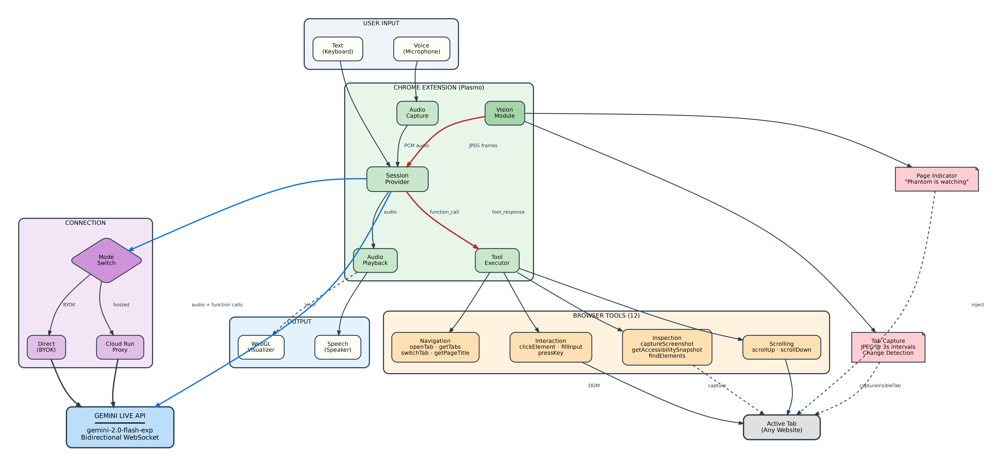
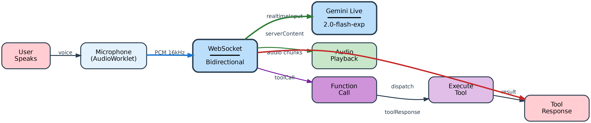
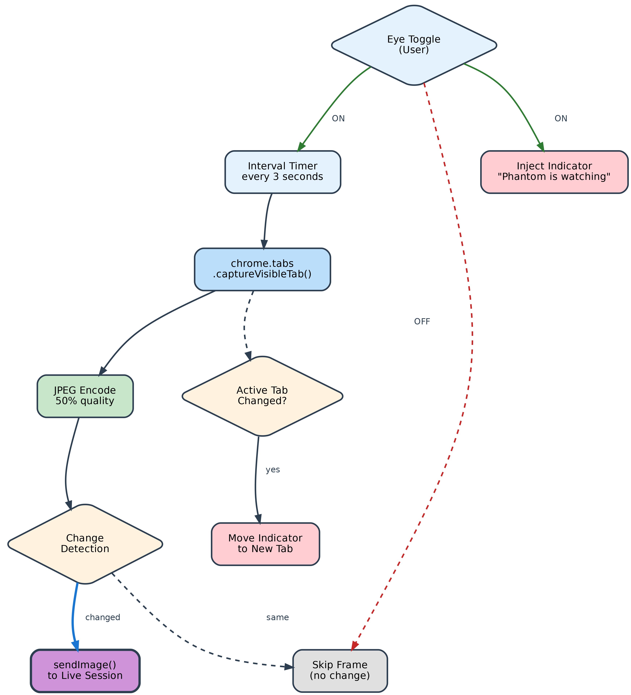
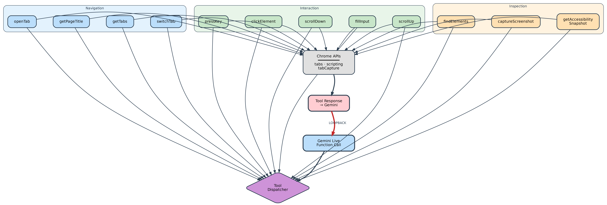
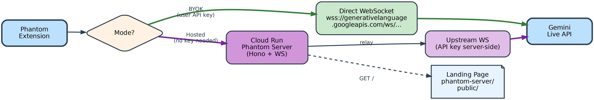

# Phantom

<div align="center">

**Voice-controlled AI agent that can see and interact with any website**

**Real-time conversation · Screen vision · Browser automation**


</div>

---

## Table of Contents

- [Overview](#overview)
- [Architecture](#architecture)
  - [System Overview](#system-overview)
  - [Gemini Live Session](#gemini-live-session)
  - [Vision Pipeline](#vision-pipeline)
  - [Tool Execution](#tool-execution)
  - [Connection Modes](#connection-modes)
- [Design Notes](#design-notes)
  - [Why Live API](#why-live-api)
  - [Vision: Continuous vs On-Demand](#vision-continuous-vs-on-demand)
  - [System Prompt Awareness](#system-prompt-awareness)
  - [Audio Pipeline](#audio-pipeline)
  - [Browser Tools](#browser-tools)
- [Setup](#setup)
- [Tech Stack](#tech-stack)
- [Project Structure](#project-structure)
- [Contributing](#contributing)
  - [Naming Convention: Plain Language](#naming-convention-plain-language)
  - [Adding a New Tool](#adding-a-new-tool)

---

## Overview

Phantom is a Chrome extension that turns your browser into a voice-controlled workspace. You talk, it listens, sees your screen, and takes action — clicking buttons, filling forms, navigating tabs, all through natural conversation powered by Gemini's Live API.

**What makes it different:**

- **Real-time voice, not chat.** Bidirectional audio streaming over WebSocket. You can interrupt it mid-sentence. It responds instantly. No typing, no waiting for transcription — just talk.
- **It can see your screen.** Toggle screen sharing and Phantom shows your active tab to Gemini once per second. It knows what you're looking at without you having to describe it.
- **It takes action.** Browser tools via function calling — click on things, type into fields, scroll pages, switch tabs, press keys. The model decides what to do and does it.
- **Zero infrastructure for users.** Either paste your own Gemini API key (free from Google AI Studio) or connect through our hosted proxy. No local models, no downloads, no setup friction.

**Key Capabilities:**

- 🎙️ Real-time bidirectional voice (Gemini Live API, WebSocket)
- 👁️ Continuous screen vision with change detection
- 🖱️ Browser automation tools via function calling
- 🌊 WebGL audio visualizer (state-aware color changes)
- 🔌 Hosted mode (Cloud Run proxy) or BYOK (bring your own key)
- 8 voice options (Puck, Charon, Kore, Fenrir, Aoede, Leda, Orus, Zephyr)
- Text input fallback for quiet environments
- "Phantom is watching" indicator on page when vision is active

---

## Architecture

### System Overview

<div align="center">

</div>

The system has four layers:

1. **User Input** — Voice (microphone → AudioWorklet → PCM 16kHz) or text (keyboard)
2. **Chrome Extension** — Session provider orchestrates audio capture, audio playback, vision module, and tool execution
3. **Connection** — Mode switch routes to either direct WebSocket (BYOK) or Cloud Run proxy (hosted)
4. **Gemini Live API** — `gemini-2.5-flash-native-audio-preview-12-2025` processes audio, generates spoken responses, and issues function calls for browser tools

Audio flows bidirectionally through a single persistent WebSocket. Tool calls arrive as structured JSON, get executed against Chrome APIs, and results feed back into the conversation.

### Gemini Live Session

<div align="center">

</div>

The Live API uses a single WebSocket connection for everything:

**Inbound (user → Gemini):**
- `realtimeInput` — PCM audio chunks from the microphone at 16kHz
- `realtimeInput` — JPEG frames from vision module
- `clientContent` — Text messages
- `toolResponse` — Results from executed browser tools

**Outbound (Gemini → user):**
- `serverContent` — Audio chunks for speech playback
- `toolCall` — Function call requests (tool name + arguments)
- `setupComplete` — Session ready signal

The session starts with a `setup` message containing the model config, system instruction, tool declarations, and voice selection. After `setupComplete`, audio flows freely in both directions. The connection stays open for the entire conversation — no request/response cycles, just continuous streaming.

**Interruption handling:** When the user speaks while Gemini is responding, the model detects the interruption and stops its current output. This happens at the protocol level — no special client logic needed.

### Vision Pipeline

<div align="center">

</div>

Vision mode lets Phantom see the user's screen by sending periodic frames to Gemini:

1. **User toggles the eye icon** in the header
2. **Interval timer** fires every 3 seconds
3. **`chrome.tabs.captureVisibleTab()`** captures the active tab as JPEG at 50% quality
4. **Change detection** compares frame signatures — if nothing changed, the frame is skipped
5. **`sendImage()`** sends the JPEG base64 to Gemini via the WebSocket
6. **Page indicator** — a "Phantom is watching" pill with a pulsing blue dot is injected into the active tab

When the user switches tabs, the indicator follows — the old one is removed and a new one is injected into the new active tab.

**Why 3 seconds?** Too frequent and Gemini's context fills up fast, causing crashes. Too infrequent and you miss page changes. 3 seconds with change detection hits the sweet spot — most static browsing sends very few frames, while active navigation captures every meaningful state.

**Why 50% JPEG?** Gemini doesn't need high-resolution images to understand page layout. Low quality keeps frame size small (~30-60KB) which matters when you're sending frames every few seconds over a WebSocket.

### Tool Execution

<div align="center">

</div>

When Gemini decides to take action, it sends a `toolCall` message with a function name and arguments. The tool executor dispatches to the appropriate Chrome API:

**Navigation (4 tools):**

| Tool | What it does |
|------|-------------|
| `getPageTitle` | Returns title and URL of the active tab |
| `openTab` | Opens a URL in a new or current tab |
| `getTabs` | Lists all open tabs with titles and URLs |
| `switchTab` | Activates a tab by index |

**Interaction (5 tools):**

| Tool | What it does |
|------|-------------|
| `clickOn` | Clicks on something on the page |
| `typeInto` | Types text into a field on the page |
| `pressKey` | Presses a keyboard key (Enter, Escape, Tab, etc.) |
| `scrollDown` | Scrolls the page down to see more content |
| `scrollUp` | Scrolls the page up to see earlier content |

**Reading the page (3 tools):**

| Tool | What it does |
|------|-------------|
| `readPageContent` | Reads the page to see all the buttons, links, inputs, and other interactive elements |
| `findOnPage` | Searches for something on the page by text or selector |
| `scrollTo` | Scrolls to a specific thing on the page so the user can see it |

There's also a `highlight` tool that highlights something on the page with a yellow outline to show the user what was found.

After execution, the result is sent back to Gemini as a `toolResponse`, and the model continues — it might speak a confirmation, call another tool, or ask a follow-up question. This creates an autonomous agent loop: observe → decide → act → observe.

### Connection Modes

<div align="center">

</div>

Phantom supports two connection modes, selected during setup:

**BYOK (Bring Your Own Key):**
- Extension connects directly to `wss://generativelanguage.googleapis.com/ws/...?key=YOUR_KEY`
- API key stored locally in `chrome.storage`
- No intermediary, lowest latency
- User gets their own Gemini quota

**Hosted:**
- Extension connects to Cloud Run proxy at `/ws/live`
- Proxy opens a parallel WebSocket to Gemini using a server-side API key
- User doesn't need an API key
- Messages relayed bidirectionally, buffered during upstream connection

The Cloud Run proxy is a lightweight Hono server (~140 lines) that adds no processing overhead — it's a transparent WebSocket relay. See [phantom-server](https://github.com/youneslaaroussi/phantom-server) for the backend.

---

## Design Notes

### Why Live API

The Gemini Live API is fundamentally different from the standard Gemini chat API. It's not request/response — it's a persistent bidirectional stream. Audio goes in, audio comes out, function calls happen inline, and the model maintains conversational state across the entire session.

This matters for a voice agent because:
- **No transcription step.** Voice goes directly to the model as PCM audio. No Speech-to-Text → LLM → Text-to-Speech pipeline.
- **Natural interruption.** The user can speak while the model is responding, and it handles it gracefully.
- **Continuous context.** The model accumulates context from everything — voice, text, images, tool results — in a single session.
- **Low latency.** One persistent WebSocket vs. repeated HTTP requests. Response starts streaming immediately.

### Vision: Continuous vs On-Demand

Phantom supports both approaches:

**Continuous (vision ON):** Frames stream automatically every 3 seconds. The model has ambient awareness of the screen. Good for guided workflows — "walk me through this form", "what am I looking at", "tell me when the page loads".

**On-demand (vision OFF):** The model uses `readPageContent` to understand what's on the page. Good for privacy and when you don't want constant screen sharing.

The system prompt changes based on which mode is active:

```
Vision ON:  "You can see the user's screen. Describe what you 
            actually see. Do NOT make up screen contents."

Vision OFF: "You cannot see the user's screen. Use readPageContent 
            to check what's on the page. Do NOT guess."
```

This prevents the model from confidently describing a page it can't actually see — a common failure mode with multimodal models.

### System Prompt Awareness

The system prompt explicitly tells Gemini what capabilities are currently available. This is critical because the Live API model will happily hallucinate visual descriptions if it thinks it has vision when it doesn't.

We split the prompt into a base instruction (always present) and an addendum that changes based on state:
- **Vision ON addendum** — tells the model it can see the screen, can reference what's on screen, should just look instead of using tools
- **Vision OFF addendum** — tells the model it can't see the screen, must use tools to check, should not guess

When the user toggles vision, the next `connect()` call rebuilds the system prompt with the correct addendum. This means the model always has accurate self-knowledge.

### Audio Pipeline

**Input:** Browser's `getUserMedia()` → `AudioWorklet` processing node → PCM Int16 at 16kHz → base64 encoded → sent as `realtimeInput` over WebSocket.

The AudioWorklet runs in a separate thread, sampling audio in real-time without blocking the main thread. Input levels are reported back for the UI visualizer.

**Output:** Base64 PCM chunks arrive from Gemini → decoded to Int16 array → queued in an `AudioPlayer` that manages a Web Audio API playback pipeline with `AudioBufferSourceNode` scheduling. Output levels drive the wave visualizer.

The wave visualizer is a WebGL shader using simplex noise, with color driven by state:
- **Red** — listening (microphone active)
- **Blue** — speaking (audio playing)
- **Purple** — executing a tool

### Browser Tools

Tools are declared to Gemini as `functionDeclarations` in the session setup. The model calls them via structured JSON in `toolCall` messages. Each tool:

1. Receives parsed arguments from the model
2. Executes via Chrome Extension APIs (`chrome.tabs`, `chrome.scripting`)
3. Returns a JSON result (`{ success, result?, error? }`)
4. Result is sent back as a `toolResponse` message

For page interaction tools (`clickOn`, `typeInto`, `findOnPage`, `readPageContent`), we use `chrome.scripting.executeScript()` to inject a function into the active tab. This runs in the page's context with full DOM access.

`readPageContent` walks the page structure, collecting all the buttons, links, inputs, and other things the user can interact with — along with their labels and selectors. This gives Gemini a structured view of what's on screen without needing to see the page visually.

`findOnPage` searches the page for matching elements by text content, aria-label, placeholder, or role — returning indexed results the model can reference in subsequent `clickOn` or `typeInto` calls.

---

## Setup

### Prerequisites

- Chrome 131+ (for Gemini Live API support)
- A Gemini API key (free from [Google AI Studio](https://aistudio.google.com/apikey)) — or use hosted mode

### Installation

```bash
# Clone repository
git clone https://github.com/youneslaaroussi/phantom.git
cd phantom

# Install dependencies
pnpm install

# Start development server
pnpm dev

# Load in Chrome:
# 1. Go to chrome://extensions
# 2. Enable "Developer mode"
# 3. Click "Load unpacked"
# 4. Select the build/chrome-mv3-dev directory
```

### Production Build

```bash
pnpm build
# Load build/chrome-mv3-prod in Chrome
```

### First Run

1. Click the Phantom icon in your toolbar (or open the side panel)
2. Choose your connection mode:
   - **Use hosted** — No API key needed, connects through our Cloud Run proxy
   - **Bring your own key** — Paste your Gemini API key (stays on your device)
3. Click the mic button and start talking

### Quick Start

**Voice commands:**
- "Open YouTube" → opens youtube.com in a new tab
- "Click the search button" → finds and clicks the search button
- "Type hello@example.com in the email field" → types into the input
- "What's on this page?" → reads the page and describes it
- "Scroll down" → scrolls the page

**Screen sharing:**
- Click the eye icon in the header to toggle
- When active, Phantom can see your screen (updates every second)
- A floating indicator appears on the page so you know Phantom is watching
- Ask "what do you see?" and it describes what's on your screen in real-time

---

## Tech Stack

| Category | Technology | Purpose |
|----------|-----------|---------|
| Framework | Plasmo | Chrome extension framework with React support |
| Language | TypeScript 5.7 | Type-safe development |
| UI | React 18 + Tailwind CSS | Component-based interface |
| AI | Gemini Live API | Real-time voice + vision + function calling |
| Audio | Web Audio API + AudioWorklet | Microphone capture and playback |
| Graphics | WebGL + GLSL | Audio wave visualizer |
| Backend | Hono | WebSocket proxy server |
| Deploy | Google Cloud Run | Hosted proxy infrastructure |
| Build | esbuild (via Plasmo) | Fast bundling |

---

## Project Structure

```
phantom/
├── popup.tsx                    # Popup entry point
├── sidepanel.tsx                # Side panel entry point
├── background.ts                # Service worker (side panel registration)
├── components/
│   ├── voice-screen.tsx         # Main UI — mic button, wave, controls, vision toggle
│   ├── settings-screen.tsx      # API key management, voice selection
│   ├── setup-screen.tsx         # First-run: hosted vs BYOK choice
│   └── wave-visualizer.tsx      # WebGL simplex noise visualizer
├── lib/
│   ├── session.tsx              # Session provider — connects everything
│   ├── tools.ts                 # 12 browser tool declarations + execution
│   ├── vision.ts                # Screen capture, change detection, frame streaming
│   ├── vision-indicator.ts      # "Phantom is watching" page injection
│   ├── api-key.ts               # Chrome storage API key management
│   ├── connection-mode.ts       # Hosted vs BYOK mode persistence
│   └── live/
│       ├── client.ts            # WebSocket client, message handling, state machine
│       ├── audio.ts             # AudioWorklet capture + AudioPlayer playback
│       ├── types.ts             # Live API message types
│       └── index.ts             # Re-exports
├── diagrams/                    # Architecture diagrams (Python + Graphviz)
├── style.css                    # Tailwind entry
├── package.json
├── tsconfig.json
├── tailwind.config.js
└── postcss.config.js
```

---

## Contributing

### Naming Convention: Plain Language

All tool names, descriptions, system prompts, and user-facing text use **natural, layman-friendly language** instead of technical jargon. This applies to both what the AI model sees and what the user sees.

**Principle:** If a non-technical person wouldn't understand it, rewrite it.

| Don't say | Say instead |
|-----------|------------|
| `captureScreenshot` | (removed — use vision or `readPageContent`) |
| `getAccessibilitySnapshot` | `readPageContent` |
| `findElements` | `findOnPage` |
| `clickElement` | `clickOn` |
| `fillInput` | `typeInto` |
| `scrollToElement` | `scrollTo` |
| `highlightElement` | `highlight` |
| "Screenshot captured" | (not applicable — tool removed) |
| "Accessibility tree" | "buttons, links, inputs, and other things you can interact with" |
| "Vision mode is active" | "You can see the user's screen" |
| "Vision mode deactivated" | "You can no longer see the user's screen" |
| "Streaming screen" | "Screen sharing on — Phantom can see your screen" |
| "Periodic screenshots" | "live view updated every second" |

This matters because:
1. **For the AI model** — simpler tool names and descriptions lead to better tool selection. The model understands "click on" better than "clickElement" and "read the page" better than "get accessibility snapshot".
2. **For the user** — tooltips, status messages, and trace labels should make sense to anyone, not just developers.

When adding new tools or prompts, follow this convention. Write descriptions as if explaining to someone who has never coded.

### Adding a New Tool

1. Add the declaration to `getToolDeclarations()` in `lib/tools.ts`:

```typescript
{
  name: "myTool",
  description: "What this tool does",
  parameters: {
    type: "object",
    properties: {
      param: { type: "string", description: "What this param is" },
    },
    required: ["param"],
  },
}
```

2. Add the execution handler in `executeTool()`:

```typescript
case "myTool": {
  const [tab] = await chrome.tabs.query({ active: true, currentWindow: true });
  if (!tab?.id) return { success: false, error: "No active tab" };
  // Do something with chrome APIs
  return { success: true, result: "Done" };
}
```

That's it. Gemini will see the tool in its function declarations and call it when appropriate.

### Regenerating Diagrams

```bash
cd diagrams
pip install graphviz
bash generate_all.sh
```

Requires the `graphviz` system package (`apt install graphviz` or `brew install graphviz`).

---

## License

MIT License — See [LICENSE](./LICENSE)
